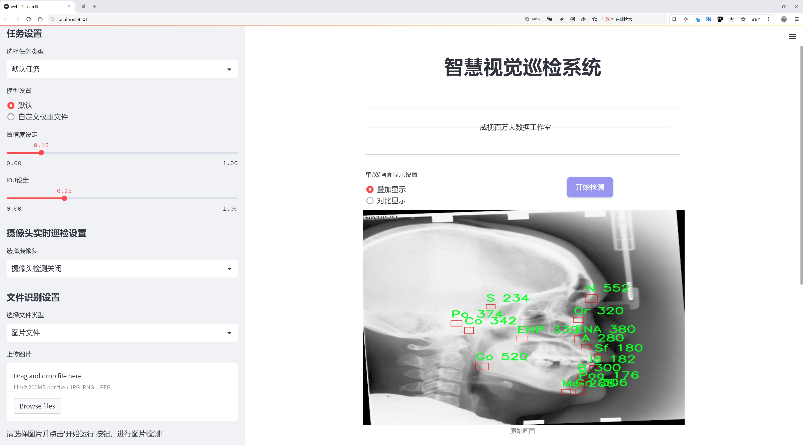
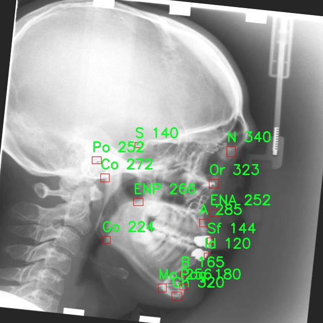
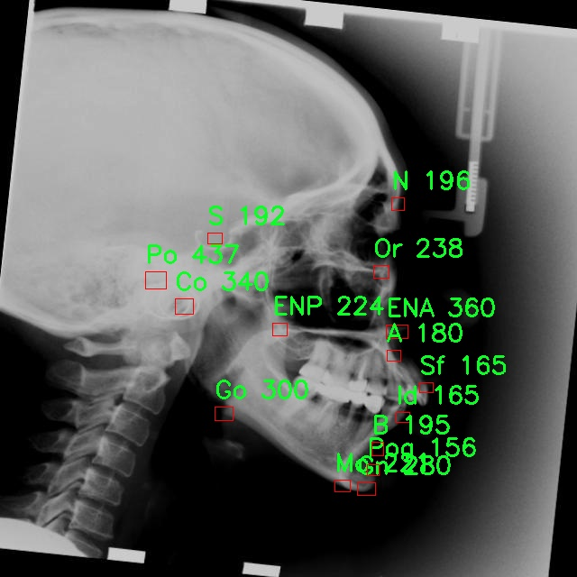
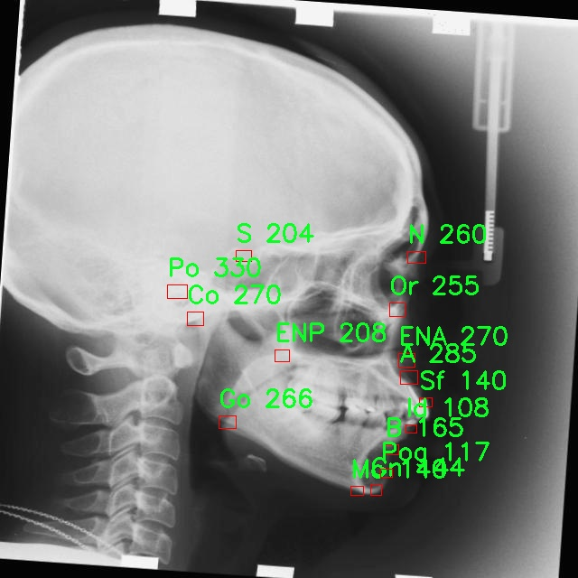

# X光图颅面测量点检测系统源码分享
 # [一条龙教学YOLOV8标注好的数据集一键训练_70+全套改进创新点发刊_Web前端展示]

### 1.研究背景与意义

项目参考[AAAI Association for the Advancement of Artificial Intelligence](https://gitee.com/qunmasj/projects)

项目来源[AACV Association for the Advancement of Computer Vision](https://kdocs.cn/l/cszuIiCKVNis)

研究背景与意义

随着医学影像技术的快速发展，X光图像在颅面测量和诊断中的应用日益广泛。颅面测量是口腔正畸、颅面外科以及颌面畸形矫正等领域的重要组成部分，能够为临床医生提供重要的解剖学信息，辅助其制定治疗方案。传统的颅面测量方法依赖于手工标记和测量，不仅耗时耗力，而且容易受到人为因素的影响，导致测量结果的准确性和一致性不足。因此，开发一种高效、准确的自动化测量系统显得尤为重要。

近年来，深度学习技术的迅猛发展为医学图像处理带来了新的机遇。YOLO（You Only Look Once）系列模型作为一种高效的目标检测算法，因其快速和准确的特性，已被广泛应用于各种图像识别任务中。YOLOv8作为该系列的最新版本，进一步提升了检测精度和速度，尤其在复杂背景下的目标检测表现出色。因此，基于改进YOLOv8的X光图颅面测量点检测系统的研究，具有重要的学术价值和实际意义。

本研究的核心在于利用YOLOv8模型对X光图像中的颅面测量点进行自动检测。通过对993幅包含15个类别（如A、B、Co、ENA等）的X光图像进行训练，系统能够有效识别和定位颅面特征点。这些特征点不仅是颅面分析的基础，还为后续的三维重建、面部美学评估和正畸治疗提供了关键数据。与传统方法相比，基于深度学习的自动检测系统能够显著提高测量的效率和准确性，减少人为误差，进而提升临床诊断的可靠性。

此外，本研究还将探索如何通过改进YOLOv8模型的网络结构和训练策略，进一步提升检测性能。例如，针对X光图像的特征，优化数据增强方法，增强模型对不同拍摄角度和光照条件的适应能力，从而提高系统的鲁棒性。这不仅有助于推动目标检测技术在医学领域的应用，也为相关算法的研究提供了新的思路。

在医学影像学领域，自动化测量系统的推广应用将大大提高临床工作效率，减轻医生的工作负担，促进医疗资源的合理配置。同时，随着数据集的不断扩展和模型的持续优化，基于YOLOv8的颅面测量点检测系统有望在未来的临床实践中发挥更大的作用，推动口腔正畸和颅面外科等领域的技术进步。

综上所述，基于改进YOLOv8的X光图颅面测量点检测系统的研究，不仅具有重要的理论意义，还将为实际临床应用提供强有力的支持，推动医学影像处理技术的发展，为患者提供更为精准和高效的医疗服务。

### 2.图片演示




##### 注意：由于此博客编辑较早，上面“2.图片演示”和“3.视频演示”展示的系统图片或者视频可能为老版本，新版本在老版本的基础上升级如下：（实际效果以升级的新版本为准）

  （1）适配了YOLOV8的“目标检测”模型和“实例分割”模型，通过加载相应的权重（.pt）文件即可自适应加载模型。

  （2）支持“图片识别”、“视频识别”、“摄像头实时识别”三种识别模式。

  （3）支持“图片识别”、“视频识别”、“摄像头实时识别”三种识别结果保存导出，解决手动导出（容易卡顿出现爆内存）存在的问题，识别完自动保存结果并导出到tempDir中。

  （4）支持Web前端系统中的标题、背景图等自定义修改，后面提供修改教程。

  另外本项目提供训练的数据集和训练教程,暂不提供权重文件（best.pt）,需要您按照教程进行训练后实现图片演示和Web前端界面演示的效果。

### 3.视频演示

[3.1 视频演示](https://www.bilibili.com/video/BV1aj2AYQEUy/)

### 4.数据集信息展示

##### 4.1 本项目数据集详细数据（类别数＆类别名）

nc: 15
names: ['A', 'B', 'Co', 'ENA', 'ENP', 'Gn', 'Go', 'Id', 'Mo', 'N', 'Or', 'Po', 'Pog', 'S', 'Sf']


##### 4.2 本项目数据集信息介绍

数据集信息展示

在本研究中，我们使用了名为“cefalometria”的数据集，旨在训练和改进YOLOv8模型，以实现对X光图像中颅面测量点的精准检测。该数据集专门针对颅面测量领域，包含了丰富的标注信息，适用于深度学习模型的训练与验证。数据集的类别数量为15，涵盖了多种关键的颅面测量点，这些测量点在颅面分析和正畸治疗中具有重要的临床意义。

具体而言，数据集中包含的类别名称包括：A、B、Co、ENA、ENP、Gn、Go、Id、Mo、N、Or、Po、Pog、S和Sf。这些类别分别代表了不同的解剖标志点，每一个标志点都在颅面结构的分析中扮演着独特的角色。例如，Gn（下颌尖）和Pog（下颌前突点）是评估下颌位置和面部轮廓的重要指标，而ENA（上颌前突点）和ENP（上颌后突点）则有助于分析上颌的形态与位置。通过对这些测量点的准确检测，临床医生能够更好地评估患者的颅面结构，从而制定个性化的治疗方案。

数据集的构建过程涉及到对大量X光图像的收集与标注，确保每个测量点的准确性和一致性。标注工作通常由专业的放射科医生或正畸专家完成，他们通过对图像的仔细分析，确定每个测量点的具体位置。这种高质量的标注不仅提高了数据集的可靠性，也为模型的训练提供了坚实的基础。

在模型训练过程中，YOLOv8作为一种先进的目标检测算法，能够有效地处理复杂的图像数据，并实时检测出各个测量点的位置。通过将“cefalometria”数据集与YOLOv8相结合，我们期望能够提升模型在颅面测量点检测任务中的准确性和鲁棒性。训练过程中，模型将通过不断迭代优化其参数，以最小化预测结果与真实标注之间的误差，从而实现对颅面测量点的高效识别。

此外，数据集的多样性和丰富性也为模型的泛化能力提供了保障。不同的X光图像可能会因拍摄角度、患者个体差异等因素而存在一定的变化，然而，通过对多样化样本的训练，模型能够学习到更为普适的特征，从而在面对未见过的图像时仍能保持良好的检测性能。

总之，“cefalometria”数据集不仅为本研究提供了必要的训练数据，也为后续的颅面测量点检测系统的开发奠定了基础。通过对该数据集的深入分析与应用，我们期待能够推动颅面分析技术的发展，提高临床诊断的效率与准确性，为患者提供更优质的医疗服务。









### 5.全套项目环境部署视频教程（零基础手把手教学）

[5.1 环境部署教程链接（零基础手把手教学）](https://www.ixigua.com/7404473917358506534?logTag=c807d0cbc21c0ef59de5)


[5.2 安装Python虚拟环境创建和依赖库安装视频教程链接（零基础手把手教学）](https://www.ixigua.com/7404474678003106304?logTag=1f1041108cd1f708b01a)

### 6.手把手YOLOV8训练视频教程（零基础小白有手就能学会）

[6.1 手把手YOLOV8训练视频教程（零基础小白有手就能学会）](https://www.ixigua.com/7404477157818401292?logTag=d31a2dfd1983c9668658)


按照上面的训练视频教程链接加载项目提供的数据集，运行train.py即可开始训练



     Epoch   gpu_mem       box       obj       cls    labels  img_size
     1/200     20.8G   0.01576   0.01955  0.007536        22      1280: 100%|██████████| 849/849 [14:42<00:00,  1.04s/it]
               Class     Images     Labels          P          R     mAP@.5 mAP@.5:.95: 100%|██████████| 213/213 [01:14<00:00,  2.87it/s]
                 all       3395      17314      0.994      0.957      0.0957      0.0843

     Epoch   gpu_mem       box       obj       cls    labels  img_size
     2/200     20.8G   0.01578   0.01923  0.007006        22      1280: 100%|██████████| 849/849 [14:44<00:00,  1.04s/it]
               Class     Images     Labels          P          R     mAP@.5 mAP@.5:.95: 100%|██████████| 213/213 [01:12<00:00,  2.95it/s]
                 all       3395      17314      0.996      0.956      0.0957      0.0845

     Epoch   gpu_mem       box       obj       cls    labels  img_size
     3/200     20.8G   0.01561    0.0191  0.006895        27      1280: 100%|██████████| 849/849 [10:56<00:00,  1.29it/s]
               Class     Images     Labels          P          R     mAP@.5 mAP@.5:.95: 100%|███████   | 187/213 [00:52<00:00,  4.04it/s]
                 all       3395      17314      0.996      0.957      0.0957      0.0845


### 7.70+种全套YOLOV8创新点代码加载调参视频教程（一键加载写好的改进模型的配置文件）

[7.1 70+种全套YOLOV8创新点代码加载调参视频教程（一键加载写好的改进模型的配置文件）](https://www.ixigua.com/7404478314661806627?logTag=29066f8288e3f4eea3a4)

### 8.70+种全套YOLOV8创新点原理讲解（非科班也可以轻松写刊发刊，V10版本正在科研待更新）

#### 由于篇幅限制，每个创新点的具体原理讲解就不一一展开，具体见下列网址中的创新点对应子项目的技术原理博客网址【Blog】：


[8.1 70+种全套YOLOV8创新点原理讲解链接](https://gitee.com/qunmasj/good)

#### 部分改进原理讲解(完整的改进原理见上图和技术博客链接)【如果此小节的图加载失败可以通过CSDN或者Github搜索该博客的标题访问原始博客，原始博客图片显示正常】
### YOLOv8简介
目前YOLO系列的SOTA模型是ultralytics公司于2023年发布的YOLOv8.按照模型宽度和深度不同分为YOLOv8n、YOLOv8s、YOLOv8m、YOLOv81、YOLOv8x五个版本。本文改进的是 YOLOv8n模型。
YOLOv8的 Backbone采用CSPDarknet结构，它是 Darknet 的一种改进，引入CSP改善网络结构。CSPDarknet把特征图分为两部分，一部分进行卷积操作，另一部分进行跳跃连接，在保持网络深度的同时减少参数量和计算量，提高网络效率。Neck 部分采用特征金字塔PANet[17]，通过自顶向下路径结合和自底向上特征传播进行多尺度融合。损失函数采用了CIloU[18]。YOLOv8的网络结构如图所示。


### ParC融合位置感知循环卷积简介
ParC：Position aware circular convolution


#### Position aware circular convolution
针对于全局信息的提取作者提出了Position aware circular convolution（也称作Global Circular Convolution）。图中左右实际是对于该操作水平竖直两方向的对称，理解时只看左边即可。对于维度为C*H*W的输入，作者先将维度为C*B*1的Position Embedding通过双线性插值函数F调整到适合input的维度C*H*1（以适应不同特征大小输入），并且将PE水平复制扩展到C*H*W维度与输入特征相加。这里作者将PE直接设置成为了可学习的参数。

接下来参考该博客将加入PE的特征图竖直方向堆叠，并且同样以插值的方式得到了适应输入维度的C*H*1大小的卷积核，进行卷积操作。对于这一步卷积，作者将之称为循环卷积，并给出了一个卷积示意图。


但个人感觉实际上这个示意图只是为了说明为什么叫循环卷积，对于具体的计算细节还是根据公式理解更好。


进一步，作者给出了这一步的伪代码来便于读者对这一卷积的理解：y=F.conv2D（torch.cat（xp，xp，dim=2），kV），实际上就是将xp堆叠之后使用了一个“条形（或柱形）”卷积核进行简单的卷积操作。（但这样会导致多一次重复卷积，因此在堆叠示意图中只取了前2*H-1行）

可以看到在示意图中特征维度变化如下：C*(2H-1)*W ---C*H*1--->C*H*W，作者特意带上了通道数，并且并没有出现通道数的改变，那么这里所进行的卷积应该是depth wise卷积，通过对文章后续以及论文源码的阅读可以得知这一步进行的就是DW卷积。（we introduce group convolution and point wise convolution into these modules, which decreases number of parameters without hurting performance.）


由groups = channel可知使用的是DW卷积
通过上面就完成了一次竖直方向的全局信息交流，同样只要在水平方向进行同样的操作即可做到水平方向的全局信息交流。

#### ParC block

通过ParC成功解决了全局信息提取的问题，接下来就是针对2）3）两点进行改进。首先是Meta-Former模块，Meta-Former由Token Mixer和Channel Mixer构成，ParC首先满足了Token Mixer的全局信息提取的要求，并且相较于Attention在计算成本上更低。


这里①中的PWC即point wise conv，进一步验证了我们前面对于深度可分离卷积的想法，而GCC-H/V即是前面所说的ParC-H/V。

①构建了Meta-Former中的Token mixer模块，那么最后剩下的问题就是3），替换掉Attention模块之后模型不再data driven。为了解决这一点作者给出了一个channel wise attention，先将特征图（x,C*H*W）进行global average（a,C*1*1）并输入一个MLP生成一个channel wise的权重（w,C*1*1），再将权重与特征图在通道方向相乘得到输出（output = wx,C*H*W）。

#### ParC net
对于ParC net 的搭建，作者直接基于MobileViT，采用了分叉结构（c）完成了网络的搭建。


具体而言作者保留了MobileViT中浅层具有局部感受野的MobileNetV2结构，而将网络深层的ViT block替换成了ParC block，使网络变成了一个pure ConvNet。


### 9.系统功能展示（检测对象为举例，实际内容以本项目数据集为准）

图9.1.系统支持检测结果表格显示

  图9.2.系统支持置信度和IOU阈值手动调节

  图9.3.系统支持自定义加载权重文件best.pt(需要你通过步骤5中训练获得)

  图9.4.系统支持摄像头实时识别

  图9.5.系统支持图片识别

  图9.6.系统支持视频识别

  图9.7.系统支持识别结果文件自动保存

  图9.8.系统支持Excel导出检测结果数据


### 10.原始YOLOV8算法原理

原始YOLOv8算法原理

YOLOv8作为最新一代的目标检测算法，延续了YOLO系列的高效性和准确性，结合了YOLOv5和YOLOv7的优点，并在此基础上进行了创新和改进。该算法的结构主要由输入层、主干网络、特征融合层（Neck）和解耦头（Head）组成。通过对这些组件的优化，YOLOv8在目标检测任务中实现了更高的精度和更快的推理速度。

在主干网络方面，YOLOv8继续采用YOLOv5的CSPDarknet结构，但对其进行了关键性的调整。C3模块被替换为C2f模块，后者引入了ELAN思想，增加了更多的跳层连接，从而有效缓解了深层网络中的梯度消失问题。这种设计不仅保持了模型的轻量化特性，还在特征提取的过程中增强了梯度流的丰富性。C2f模块由多个CBS（卷积+归一化+SiLU激活）模块和若干个Bottleneck构成，确保了特征图在经过多次处理后，能够保留更多的有用信息。特别是在特征图的尺寸保持一致的情况下，C2f模块能够有效提取目标的细节特征，并为后续的特征融合提供高质量的输入。

特征融合层（Neck）采用了PAN-FPN结构，这一结构的设计旨在实现多尺度特征的深度融合。YOLOv8在此阶段对高层特征和中层特征进行了自下而上的融合，确保了不同层次特征的有效利用。通过去除上采样阶段的冗余卷积，YOLOv8能够更直接地将高层特征与中层特征进行连接，进一步提升了特征融合的效率。最终，经过Neck处理的特征图将被送入解耦头进行目标检测。

在解耦头的设计上，YOLOv8借鉴了YOLOX和YOLOv6的思想，采用了Anchor-Free的策略，摒弃了传统的Anchor-Base方法。这一转变使得模型能够直接预测目标的中心位置，并通过Task-Aligned的匹配策略来优化正负样本的区分。解耦头分为两个并行的分支，分别负责分类和回归任务，这种结构的设计使得分类和定位的损失函数能够更有效地结合，进而提升了模型的整体性能。YOLOv8的Head部分输出三个不同尺度的特征图，分别为80x80、40x40和20x20，这些特征图通过Softmax和卷积操作生成最终的边框预测结果。

在损失函数的选择上，YOLOv8采用了VFLLoss作为分类损失，并结合DFLLoss和CIoULoss来处理回归任务。这种组合不仅能够有效解决样本不平衡的问题，还能够提升模型对小目标的检测能力。尤其是在面对像输电线路等复杂场景时，YOLOv8的损失函数设计能够确保模型在训练过程中更好地关注困难样本，从而提高检测精度。

为了增强模型的鲁棒性，YOLOv8在数据预处理阶段采用了多种数据增强技术，包括马赛克增强、混合增强、空间扰动和颜色扰动等。这些技术的应用使得模型在训练过程中能够接触到更为多样化的样本，从而提升了其泛化能力和适应性。尽管在训练的最后阶段停止使用马赛克增强以避免数据分布的偏差，YOLOv8依然能够通过其他增强手段有效提升模型的性能。

总的来说，YOLOv8在多个方面进行了创新和优化，特别是在主干网络的结构设计、特征融合的效率以及解耦头的功能上，都体现了其作为SOTA算法的优势。通过对YOLOv5和YOLOv7的有效整合，YOLOv8不仅在检测精度上取得了显著提升，还在推理速度上保持了良好的表现。这使得YOLOv8在实际应用中，尤其是在需要实时检测的场景中，展现出了极大的潜力和价值。随着YOLOv8的不断发展和完善，其在目标检测领域的应用前景将更加广阔，值得进一步的研究和探索。


### 11.项目核心源码讲解（再也不用担心看不懂代码逻辑）

#### 11.1 ui.py

以下是对代码的核心部分进行提炼和详细注释的版本：

```python
import sys  # 导入系统模块，用于获取Python解释器的路径
import subprocess  # 导入子进程模块，用于执行外部命令

def run_script(script_path):
    """
    使用当前 Python 环境运行指定的脚本。

    Args:
        script_path (str): 要运行的脚本路径

    Returns:
        None
    """
    # 获取当前 Python 解释器的路径
    python_path = sys.executable

    # 构建运行命令，使用 streamlit 运行指定的脚本
    command = f'"{python_path}" -m streamlit run "{script_path}"'

    # 执行命令，并等待其完成
    result = subprocess.run(command, shell=True)
    
    # 检查命令执行的返回码，如果不为0则表示出错
    if result.returncode != 0:
        print("脚本运行出错。")

# 程序入口
if __name__ == "__main__":
    # 指定要运行的脚本路径
    script_path = "web.py"  # 这里假设脚本在当前目录下

    # 调用函数运行脚本
    run_script(script_path)
```

### 代码核心部分分析：
1. **导入模块**：
   - `sys`模块用于获取当前Python解释器的路径。
   - `subprocess`模块用于执行外部命令。

2. **`run_script`函数**：
   - 该函数接受一个参数`script_path`，表示要运行的Python脚本的路径。
   - 使用`sys.executable`获取当前Python解释器的路径。
   - 构建一个命令字符串，用于通过`streamlit`运行指定的脚本。
   - 使用`subprocess.run`执行该命令，并等待其完成。
   - 检查命令的返回码，如果返回码不为0，表示脚本运行出错，打印错误信息。

3. **程序入口**：
   - 通过`if __name__ == "__main__":`判断程序是否作为主程序运行。
   - 指定要运行的脚本路径（这里假设为`web.py`）。
   - 调用`run_script`函数来执行指定的脚本。 

### 注意事项：
- 在实际使用中，`script_path`的值可以根据需要进行修改，以指向不同的脚本文件。
- 需要确保`streamlit`库已安装并且可以在当前Python环境中使用。

这个文件是一个名为 `ui.py` 的 Python 脚本，主要功能是通过当前的 Python 环境来运行一个指定的脚本，具体是通过 Streamlit 框架来启动一个 Web 应用。

首先，文件导入了几个必要的模块，包括 `sys`、`os` 和 `subprocess`。其中，`sys` 模块用于访问与 Python 解释器相关的变量和函数，`os` 模块提供了与操作系统交互的功能，而 `subprocess` 模块则用于创建新进程、连接到它们的输入/输出/错误管道，并获取它们的返回码。

接着，文件从 `QtFusion.path` 模块中导入了 `abs_path` 函数，这个函数的作用是获取给定路径的绝对路径，确保后续操作中使用的是完整的文件路径。

在 `run_script` 函数中，定义了一个接受脚本路径作为参数的功能。函数首先获取当前 Python 解释器的路径，接着构建一个命令字符串，这个命令是用来运行指定的脚本的，具体使用了 Streamlit 的命令行接口。通过 `subprocess.run` 方法，函数执行这个命令，并且通过 `shell=True` 参数允许在 shell 中执行命令。执行后，函数检查返回码，如果返回码不为零，表示脚本运行出错，程序会输出一条错误信息。

在文件的最后部分，使用了一个标准的 Python 入口点 `if __name__ == "__main__":`，这意味着当这个脚本被直接运行时，以下代码会被执行。这里指定了要运行的脚本路径，调用 `abs_path` 函数获取 `web.py` 的绝对路径，然后调用 `run_script` 函数来执行这个脚本。

总体来看，这个 `ui.py` 文件的主要功能是提供一个简单的接口，通过命令行运行一个 Streamlit 应用脚本，便于用户在本地环境中启动和测试 Web 应用。

#### 11.2 70+种YOLOv8算法改进源码大全和调试加载训练教程（非必要）\ultralytics\utils\triton.py

以下是代码中最核心的部分，并附上详细的中文注释：

```python
import numpy as np
from urllib.parse import urlsplit

class TritonRemoteModel:
    """
    与远程Triton推理服务器模型交互的客户端。

    属性:
        endpoint (str): Triton服务器上模型的名称。
        url (str): Triton服务器的URL。
        triton_client: Triton客户端（HTTP或gRPC）。
        InferInput: Triton客户端的输入类。
        InferRequestedOutput: Triton客户端的输出请求类。
        input_formats (List[str]): 模型输入的数据类型。
        np_input_formats (List[type]): 模型输入的numpy数据类型。
        input_names (List[str]): 模型输入的名称。
        output_names (List[str]): 模型输出的名称。
    """

    def __init__(self, url: str, endpoint: str = '', scheme: str = ''):
        """
        初始化TritonRemoteModel。

        参数可以单独提供，也可以从以下格式的'url'参数中解析：
            <scheme>://<netloc>/<endpoint>/<task_name>

        参数:
            url (str): Triton服务器的URL。
            endpoint (str): Triton服务器上模型的名称。
            scheme (str): 通信方案（'http'或'gRPC'）。
        """
        # 如果没有提供endpoint和scheme，则从URL中解析
        if not endpoint and not scheme:
            splits = urlsplit(url)  # 解析URL
            endpoint = splits.path.strip('/').split('/')[0]  # 获取模型名称
            scheme = splits.scheme  # 获取通信方案
            url = splits.netloc  # 获取网络位置

        self.endpoint = endpoint  # 设置模型名称
        self.url = url  # 设置服务器URL

        # 根据通信方案选择Triton客户端
        if scheme == 'http':
            import tritonclient.http as client  # 导入HTTP客户端
            self.triton_client = client.InferenceServerClient(url=self.url, verbose=False, ssl=False)
            config = self.triton_client.get_model_config(endpoint)  # 获取模型配置
        else:
            import tritonclient.grpc as client  # 导入gRPC客户端
            self.triton_client = client.InferenceServerClient(url=self.url, verbose=False, ssl=False)
            config = self.triton_client.get_model_config(endpoint, as_json=True)['config']  # 获取模型配置

        # 按字母顺序排序输出名称
        config['output'] = sorted(config['output'], key=lambda x: x.get('name'))

        # 定义模型属性
        type_map = {'TYPE_FP32': np.float32, 'TYPE_FP16': np.float16, 'TYPE_UINT8': np.uint8}
        self.InferRequestedOutput = client.InferRequestedOutput  # 设置输出请求类
        self.InferInput = client.InferInput  # 设置输入类
        self.input_formats = [x['data_type'] for x in config['input']]  # 获取输入数据类型
        self.np_input_formats = [type_map[x] for x in self.input_formats]  # 获取numpy数据类型
        self.input_names = [x['name'] for x in config['input']]  # 获取输入名称
        self.output_names = [x['name'] for x in config['output']]  # 获取输出名称

    def __call__(self, *inputs: np.ndarray) -> List[np.ndarray]:
        """
        使用给定的输入调用模型。

        参数:
            *inputs (List[np.ndarray]): 模型的输入数据。

        返回:
            List[np.ndarray]: 模型输出。
        """
        infer_inputs = []  # 存储推理输入
        input_format = inputs[0].dtype  # 获取输入数据类型
        for i, x in enumerate(inputs):
            # 如果输入数据类型与模型要求不符，则转换数据类型
            if x.dtype != self.np_input_formats[i]:
                x = x.astype(self.np_input_formats[i])
            # 创建InferInput对象并设置数据
            infer_input = self.InferInput(self.input_names[i], [*x.shape], self.input_formats[i].replace('TYPE_', ''))
            infer_input.set_data_from_numpy(x)  # 从numpy数组设置数据
            infer_inputs.append(infer_input)  # 添加到推理输入列表

        # 创建InferRequestedOutput对象以请求输出
        infer_outputs = [self.InferRequestedOutput(output_name) for output_name in self.output_names]
        # 调用Triton客户端进行推理
        outputs = self.triton_client.infer(model_name=self.endpoint, inputs=infer_inputs, outputs=infer_outputs)

        # 返回输出结果，转换为原始输入数据类型
        return [outputs.as_numpy(output_name).astype(input_format) for output_name in self.output_names]
```

### 代码核心部分说明：
1. **类的定义**：`TritonRemoteModel`类用于与Triton推理服务器进行交互，包含了模型的基本信息和输入输出的处理。
2. **初始化方法**：在`__init__`方法中，解析URL并初始化Triton客户端，获取模型的输入输出配置。
3. **调用模型**：`__call__`方法实现了模型的推理过程，接受输入数据，进行必要的数据类型转换，创建推理输入对象，调用Triton客户端进行推理，并返回输出结果。

该程序文件定义了一个名为 `TritonRemoteModel` 的类，用于与远程的 Triton 推理服务器模型进行交互。该类的主要功能是初始化与 Triton 服务器的连接，并提供调用模型进行推理的接口。

在类的初始化方法 `__init__` 中，用户可以通过传入 URL、模型名称和通信协议（HTTP 或 gRPC）来设置连接。如果没有提供模型名称和协议，程序会从 URL 中解析这些信息。初始化过程中，程序会根据指定的通信协议导入相应的 Triton 客户端库，并获取模型的配置。模型的输入和输出信息会被提取并存储为类的属性，包括输入输出的名称和数据类型。

`__call__` 方法是该类的核心功能之一，它允许用户以类似函数调用的方式使用模型。用户可以传入一个或多个 NumPy 数组作为输入数据。该方法会检查输入数据的类型，并根据模型的要求进行必要的类型转换。然后，它会创建 Triton 客户端所需的输入对象，并将数据设置到这些对象中。接着，程序会发起推理请求，并返回模型的输出结果。

总体而言，这个类提供了一个方便的接口，使得用户能够轻松地与 Triton 推理服务器进行交互，进行模型推理操作。通过封装复杂的细节，用户只需关注输入和输出的数据格式，而不必深入了解底层的实现细节。

#### 11.3 70+种YOLOv8算法改进源码大全和调试加载训练教程（非必要）\ultralytics\nn\backbone\convnextv2.py

以下是经过简化和注释的核心代码部分：

```python
import torch
import torch.nn as nn
import torch.nn.functional as F

class LayerNorm(nn.Module):
    """ 实现层归一化（Layer Normalization），支持两种数据格式：channels_last 和 channels_first。 """
    def __init__(self, normalized_shape, eps=1e-6, data_format="channels_last"):
        super().__init__()
        # 权重和偏置参数
        self.weight = nn.Parameter(torch.ones(normalized_shape))
        self.bias = nn.Parameter(torch.zeros(normalized_shape))
        self.eps = eps
        self.data_format = data_format
        if self.data_format not in ["channels_last", "channels_first"]:
            raise NotImplementedError 
        self.normalized_shape = (normalized_shape, )
    
    def forward(self, x):
        # 根据数据格式进行归一化
        if self.data_format == "channels_last":
            return F.layer_norm(x, self.normalized_shape, self.weight, self.bias, self.eps)
        elif self.data_format == "channels_first":
            u = x.mean(1, keepdim=True)
            s = (x - u).pow(2).mean(1, keepdim=True)
            x = (x - u) / torch.sqrt(s + self.eps)
            x = self.weight[:, None, None] * x + self.bias[:, None, None]
            return x

class Block(nn.Module):
    """ ConvNeXtV2的基本模块，包含深度可分离卷积和前馈网络。 """
    def __init__(self, dim, drop_path=0.):
        super().__init__()
        # 深度可分离卷积
        self.dwconv = nn.Conv2d(dim, dim, kernel_size=7, padding=3, groups=dim)
        self.norm = LayerNorm(dim, eps=1e-6)
        self.pwconv1 = nn.Linear(dim, 4 * dim)  # 1x1卷积
        self.act = nn.GELU()  # 激活函数
        self.pwconv2 = nn.Linear(4 * dim, dim)  # 1x1卷积
        self.drop_path = nn.Identity() if drop_path <= 0. else nn.Dropout(drop_path)

    def forward(self, x):
        input = x
        x = self.dwconv(x)  # 深度卷积
        x = x.permute(0, 2, 3, 1)  # 转换维度顺序
        x = self.norm(x)  # 归一化
        x = self.pwconv1(x)  # 1x1卷积
        x = self.act(x)  # 激活
        x = self.pwconv2(x)  # 1x1卷积
        x = x.permute(0, 3, 1, 2)  # 恢复维度顺序
        x = input + self.drop_path(x)  # 残差连接
        return x

class ConvNeXtV2(nn.Module):
    """ ConvNeXt V2模型，包含多个特征分辨率阶段和残差块。 """
    def __init__(self, in_chans=3, num_classes=1000, depths=[3, 3, 9, 3], dims=[96, 192, 384, 768], drop_path_rate=0.):
        super().__init__()
        self.downsample_layers = nn.ModuleList()  # 下采样层
        # 初始化下采样层
        stem = nn.Sequential(
            nn.Conv2d(in_chans, dims[0], kernel_size=4, stride=4),
            LayerNorm(dims[0], eps=1e-6, data_format="channels_first")
        )
        self.downsample_layers.append(stem)
        for i in range(3):
            downsample_layer = nn.Sequential(
                LayerNorm(dims[i], eps=1e-6, data_format="channels_first"),
                nn.Conv2d(dims[i], dims[i+1], kernel_size=2, stride=2),
            )
            self.downsample_layers.append(downsample_layer)

        self.stages = nn.ModuleList()  # 特征分辨率阶段
        for i in range(4):
            stage = nn.Sequential(
                *[Block(dim=dims[i]) for _ in range(depths[i])]
            )
            self.stages.append(stage)

        self.norm = nn.LayerNorm(dims[-1], eps=1e-6)  # 最后的归一化层
        self.head = nn.Linear(dims[-1], num_classes)  # 分类头

    def forward(self, x):
        for i in range(4):
            x = self.downsample_layers[i](x)  # 下采样
            x = self.stages[i](x)  # 特征提取
        return x
```

### 代码注释说明：
1. **LayerNorm**: 实现了层归一化，支持两种数据格式，分别是`channels_last`和`channels_first`。根据输入数据的格式选择不同的归一化方式。
2. **Block**: 这是ConvNeXtV2的基本构建块，包含深度可分离卷积、归一化、激活函数和残差连接。
3. **ConvNeXtV2**: 这是整个模型的主体，包含多个下采样层和特征提取阶段，每个阶段由多个Block组成。最后通过一个线性层进行分类。

这个程序文件是一个实现了ConvNeXt V2模型的PyTorch代码，主要用于图像分类任务。文件中包含了多个类和函数，每个部分都有其特定的功能。

首先，文件引入了必要的库，包括PyTorch的核心库和一些辅助功能，比如`DropPath`和`trunc_normal_`。这些库为模型的构建和训练提供了基础。

接下来，定义了一个`LayerNorm`类，这是一个层归一化模块，支持两种数据格式：`channels_last`和`channels_first`。在`forward`方法中，根据输入数据的格式选择不同的归一化方式，以确保模型在不同输入格式下的兼容性。

然后是`GRN`类，表示全局响应归一化层。这个层通过计算输入的L2范数来进行归一化，并使用可学习的参数`gamma`和`beta`来调整输出。

`Block`类实现了ConvNeXt V2的基本构建块。它包含了深度可分离卷积、层归一化、点卷积、激活函数（GELU）和全局响应归一化等组件。`drop_path`参数用于实现随机深度，增加模型的鲁棒性。

`ConvNeXtV2`类是整个模型的核心部分。它接受输入通道数、类别数、每个阶段的块数、特征维度、随机深度率等参数。在初始化中，模型构建了下采样层和多个特征分辨率阶段，每个阶段由多个残差块组成。最后，模型还定义了一个线性层作为分类头，并初始化权重。

`update_weight`函数用于更新模型的权重，确保加载的权重与模型结构匹配。这个函数会检查权重字典中的每个键，并将匹配的权重更新到模型中。

接下来的几个函数（如`convnextv2_atto`、`convnextv2_femto`等）是不同规模的ConvNeXt V2模型的构造函数。每个函数都定义了不同的深度和特征维度，并提供了加载预训练权重的功能。

总体而言，这个文件实现了ConvNeXt V2模型的完整结构，包括模型的各个组成部分和不同规模的模型构造函数，适用于各种图像分类任务。通过灵活的参数设置，用户可以根据需要调整模型的复杂度和性能。

#### 11.4 code\web.py

以下是经过简化和注释的核心代码部分，主要包括图像处理、检测结果绘制和界面设置等功能。

```python
import cv2
import numpy as np
from PIL import ImageFont, ImageDraw, Image
import streamlit as st

def draw_with_chinese(image, text, position, font_size=20, color=(255, 0, 0)):
    """
    在OpenCV图像上绘制中文文字
    """
    # 将图像从 OpenCV 格式（BGR）转换为 PIL 格式（RGB）
    image_pil = Image.fromarray(cv2.cvtColor(image, cv2.COLOR_BGR2RGB))
    draw = ImageDraw.Draw(image_pil)
    # 使用指定的字体
    font = ImageFont.truetype("simsun.ttc", font_size, encoding="unic")
    draw.text(position, text, font=font, fill=color)
    # 将图像从 PIL 格式（RGB）转换回 OpenCV 格式（BGR）
    return cv2.cvtColor(np.array(image_pil), cv2.COLOR_RGB2BGR)

def adjust_parameter(image_size, base_size=1000):
    """
    根据图像的最大尺寸计算自适应参数
    """
    max_size = max(image_size)
    return max_size / base_size

def draw_detections(image, info):
    """
    在图像上绘制检测结果，包括边界框和标签
    """
    name, bbox = info['class_name'], info['bbox']
    adjust_param = adjust_parameter(image.shape[:2])  # 获取自适应参数
    x1, y1, x2, y2 = bbox
    # 绘制矩形框
    cv2.rectangle(image, (x1, y1), (x2, y2), color=(0, 0, 255), thickness=int(3 * adjust_param))
    # 绘制标签
    label_area = f"{name}"
    image = draw_with_chinese(image, label_area, (x1, y1 - int(30 * adjust_param)), font_size=int(35 * adjust_param))
    return image

class Detection_UI:
    """
    检测系统类，负责界面和检测逻辑
    """
    def __init__(self):
        """
        初始化检测系统的参数
        """
        self.title = "智慧视觉巡检系统"
        self.setup_page()  # 初始化页面布局
        self.model_type = None
        self.conf_threshold = 0.15  # 默认置信度阈值
        self.iou_threshold = 0.5  # 默认IOU阈值
        self.selected_camera = None
        self.uploaded_file = None
        self.logTable = []  # 用于记录检测结果

    def setup_page(self):
        """
        设置页面布局
        """
        st.markdown(f'<h1 style="text-align: center;">{self.title}</h1>', unsafe_allow_html=True)

    def process_camera_or_file(self):
        """
        处理摄像头或文件输入，进行检测
        """
        if self.selected_camera:
            # 处理摄像头输入
            cap = cv2.VideoCapture(self.selected_camera)
            while cap.isOpened():
                ret, frame = cap.read()
                if ret:
                    # 进行检测并绘制结果
                    image = self.frame_process(frame)
                    st.image(image, channels="BGR", caption="检测结果")
                else:
                    break
            cap.release()
        elif self.uploaded_file is not None:
            # 处理上传的文件
            image = cv2.imread(self.uploaded_file)
            image = self.frame_process(image)
            st.image(image, channels="BGR", caption="检测结果")

    def frame_process(self, image):
        """
        处理单个图像帧的内容，进行检测
        """
        # 模拟检测结果
        det_info = {'class_name': '目标', 'bbox': [50, 50, 200, 200]}  # 示例检测信息
        image = draw_detections(image, det_info)  # 绘制检测结果
        return image

# 实例化并运行应用
if __name__ == "__main__":
    app = Detection_UI()
    app.process_camera_or_file()  # 启动检测
```

### 代码注释说明：
1. **draw_with_chinese**: 该函数用于在图像上绘制中文文本，使用PIL库处理中文字体。
2. **adjust_parameter**: 根据图像的最大尺寸计算自适应参数，以便在绘制时调整线条的粗细。
3. **draw_detections**: 在图像上绘制检测到的目标的边界框和标签。
4. **Detection_UI**: 该类负责整个检测系统的界面和逻辑，包括初始化参数、设置页面和处理输入（摄像头或文件）。
5. **process_camera_or_file**: 根据用户选择的输入源（摄像头或文件）进行处理，并显示检测结果。
6. **frame_process**: 处理单个图像帧，模拟检测并调用绘制函数。

这个程序文件 `code\web.py` 是一个基于 Streamlit 的图像和视频检测应用，主要用于实时监控和检测。它集成了计算机视觉技术，使用深度学习模型进行物体检测，并能够在图像上绘制检测结果。以下是对代码的详细说明。

首先，程序导入了一系列必要的库，包括用于图像处理的 OpenCV、用于数值计算的 NumPy、用于创建 Web 应用的 Streamlit，以及其他一些辅助工具和自定义模块。程序的核心功能是检测图像或视频中的物体，并将检测结果可视化。

在程序中，定义了多个函数来处理不同的任务。例如，`draw_with_chinese` 函数用于在图像上绘制中文文本，`adjust_parameter` 函数根据图像的大小自适应调整参数，`draw_detections` 函数负责在图像上绘制检测框和标签。`calculate_polygon_area` 函数用于计算多边形的面积，`format_time` 函数用于格式化时间。

接下来，定义了一个 `Detection_UI` 类，负责整个检测系统的逻辑和用户界面。类的初始化方法中，设置了一些基本参数，包括模型类型、置信度阈值、IOU 阈值等，并加载可用的摄像头列表和深度学习模型。该类还包含多个方法来设置页面布局、处理用户输入、处理摄像头或文件输入等。

在 `setup_sidebar` 方法中，程序创建了一个侧边栏，用户可以在其中选择模型类型、摄像头、文件类型等。用户上传的文件可以是图片或视频，程序会根据选择的输入源进行相应的处理。

`process_camera_or_file` 方法是核心功能之一，它根据用户选择的输入源（摄像头或文件）进行处理。如果选择了摄像头，程序会使用 OpenCV 捕获视频流，并对每一帧进行检测。如果选择了上传的文件，程序会读取文件并进行相应的处理。检测结果会实时更新并显示在页面上。

在处理每一帧时，程序会调用 `frame_process` 方法，该方法对输入图像进行预处理，使用深度学习模型进行预测，并绘制检测结果。检测信息会被记录到日志表中，便于后续查看和导出。

最后，程序的主入口部分实例化 `Detection_UI` 类并运行应用。整个应用的设计旨在提供一个用户友好的界面，方便用户进行实时监控和检测，适用于安全监控、智能巡检等场景。

#### 11.5 train.py

以下是经过简化和注释的核心代码部分：

```python
import random
import numpy as np
import torch.nn as nn
from ultralytics.data import build_dataloader, build_yolo_dataset
from ultralytics.engine.trainer import BaseTrainer
from ultralytics.models import yolo
from ultralytics.nn.tasks import DetectionModel
from ultralytics.utils import LOGGER, RANK
from ultralytics.utils.torch_utils import de_parallel, torch_distributed_zero_first

class DetectionTrainer(BaseTrainer):
    """
    DetectionTrainer类用于基于YOLO模型进行目标检测的训练。
    """

    def build_dataset(self, img_path, mode="train", batch=None):
        """
        构建YOLO数据集。

        参数:
            img_path (str): 包含图像的文件夹路径。
            mode (str): 模式，`train`表示训练模式，`val`表示验证模式。
            batch (int, optional): 批次大小，适用于`rect`模式。默认为None。
        """
        gs = max(int(de_parallel(self.model).stride.max() if self.model else 0), 32)  # 获取模型的最大步幅
        return build_yolo_dataset(self.args, img_path, batch, self.data, mode=mode, rect=mode == "val", stride=gs)

    def get_dataloader(self, dataset_path, batch_size=16, rank=0, mode="train"):
        """构建并返回数据加载器。"""
        assert mode in ["train", "val"]  # 确保模式有效
        with torch_distributed_zero_first(rank):  # 在分布式环境中，确保数据集只初始化一次
            dataset = self.build_dataset(dataset_path, mode, batch_size)
        shuffle = mode == "train"  # 训练模式下打乱数据
        workers = self.args.workers if mode == "train" else self.args.workers * 2  # 根据模式设置工作线程数
        return build_dataloader(dataset, batch_size, workers, shuffle, rank)  # 返回数据加载器

    def preprocess_batch(self, batch):
        """对图像批次进行预处理，包括缩放和转换为浮点数。"""
        batch["img"] = batch["img"].to(self.device, non_blocking=True).float() / 255  # 将图像转换为浮点数并归一化
        if self.args.multi_scale:  # 如果启用多尺度
            imgs = batch["img"]
            sz = (
                random.randrange(self.args.imgsz * 0.5, self.args.imgsz * 1.5 + self.stride)
                // self.stride
                * self.stride
            )  # 随机选择图像大小
            sf = sz / max(imgs.shape[2:])  # 计算缩放因子
            if sf != 1:
                ns = [
                    math.ceil(x * sf / self.stride) * self.stride for x in imgs.shape[2:]
                ]  # 计算新的图像形状
                imgs = nn.functional.interpolate(imgs, size=ns, mode="bilinear", align_corners=False)  # 进行插值
            batch["img"] = imgs  # 更新批次图像
        return batch

    def get_model(self, cfg=None, weights=None, verbose=True):
        """返回YOLO目标检测模型。"""
        model = DetectionModel(cfg, nc=self.data["nc"], verbose=verbose and RANK == -1)  # 创建检测模型
        if weights:
            model.load(weights)  # 加载权重
        return model

    def plot_training_samples(self, batch, ni):
        """绘制训练样本及其注释。"""
        plot_images(
            images=batch["img"],
            batch_idx=batch["batch_idx"],
            cls=batch["cls"].squeeze(-1),
            bboxes=batch["bboxes"],
            paths=batch["im_file"],
            fname=self.save_dir / f"train_batch{ni}.jpg",
            on_plot=self.on_plot,
        )

    def plot_metrics(self):
        """从CSV文件中绘制指标。"""
        plot_results(file=self.csv, on_plot=self.on_plot)  # 保存结果图
```

### 代码注释说明：
1. **DetectionTrainer类**：该类继承自`BaseTrainer`，用于处理YOLO模型的训练过程。
2. **build_dataset方法**：构建YOLO数据集，接收图像路径、模式和批次大小作为参数。
3. **get_dataloader方法**：创建数据加载器，支持训练和验证模式，确保在分布式环境中只初始化一次数据集。
4. **preprocess_batch方法**：对输入的图像批次进行预处理，包括归一化和可能的多尺度调整。
5. **get_model方法**：返回一个YOLO目标检测模型，并可选择加载预训练权重。
6. **plot_training_samples方法**：绘制训练样本及其对应的标注信息。
7. **plot_metrics方法**：从CSV文件中绘制训练过程中的指标。

这个程序文件 `train.py` 是一个用于训练目标检测模型的代码，主要基于 YOLO（You Only Look Once）架构。它继承自 `BaseTrainer` 类，提供了一系列方法来构建数据集、获取数据加载器、预处理图像、设置模型属性、获取模型、验证模型、记录损失、显示训练进度以及绘制训练样本和指标。

首先，文件导入了一些必要的库和模块，包括数学运算、随机数生成、深度学习相关的 PyTorch 库，以及 Ultralytics 提供的各种工具和功能模块。接着，定义了 `DetectionTrainer` 类，该类专门用于训练基于检测模型的任务。

在 `build_dataset` 方法中，程序根据给定的图像路径和模式（训练或验证）构建 YOLO 数据集。它使用 `build_yolo_dataset` 函数来创建数据集，并根据模型的步幅（stride）来确定图像的处理方式。

`get_dataloader` 方法则负责构建并返回数据加载器。它会根据模式（训练或验证）来决定是否打乱数据，并根据给定的批次大小和工作线程数来创建数据加载器。

`preprocess_batch` 方法用于对一批图像进行预处理，包括将图像缩放到合适的大小并转换为浮点数格式。它还支持多尺度训练，通过随机选择图像的大小来增强模型的鲁棒性。

`set_model_attributes` 方法用于设置模型的属性，包括类别数量和类别名称等，以确保模型能够正确处理数据集中的类别信息。

`get_model` 方法返回一个 YOLO 检测模型实例，并可以加载预训练的权重。

`get_validator` 方法返回一个用于验证 YOLO 模型的验证器，能够计算并记录损失值。

`label_loss_items` 方法用于返回一个包含标记训练损失项的字典，方便后续的损失监控和记录。

`progress_string` 方法生成一个格式化的字符串，用于显示训练进度，包括当前的轮次、GPU 内存使用情况、损失值、实例数量和图像大小等信息。

`plot_training_samples` 方法用于绘制训练样本及其注释，帮助可视化训练过程中的数据。

最后，`plot_metrics` 和 `plot_training_labels` 方法分别用于绘制训练过程中的指标和创建带标签的训练图，进一步增强了训练过程的可视化效果。

整体来看，这个文件实现了一个完整的目标检测模型训练流程，涵盖了数据准备、模型构建、训练过程监控和结果可视化等多个方面。

#### 11.6 code\ultralytics\models\sam\modules\transformer.py

以下是代码中最核心的部分，并附上详细的中文注释：

```python
import math
import torch
from torch import Tensor, nn

class Attention(nn.Module):
    """一个注意力层，允许在投影到查询、键和值后对嵌入的大小进行下采样。"""

    def __init__(self, embedding_dim: int, num_heads: int, downsample_rate: int = 1) -> None:
        """
        初始化注意力模型，设置嵌入维度和其他参数。

        Args:
            embedding_dim (int): 输入嵌入的维度。
            num_heads (int): 注意力头的数量。
            downsample_rate (int, optional): 内部维度下采样的因子，默认为1。
        """
        super().__init__()
        self.embedding_dim = embedding_dim
        self.internal_dim = embedding_dim // downsample_rate  # 计算内部维度
        self.num_heads = num_heads
        assert self.internal_dim % num_heads == 0, "num_heads must divide embedding_dim."  # 确保num_heads能整除内部维度

        # 定义线性投影层
        self.q_proj = nn.Linear(embedding_dim, self.internal_dim)  # 查询的线性投影
        self.k_proj = nn.Linear(embedding_dim, self.internal_dim)  # 键的线性投影
        self.v_proj = nn.Linear(embedding_dim, self.internal_dim)  # 值的线性投影
        self.out_proj = nn.Linear(self.internal_dim, embedding_dim)  # 输出的线性投影

    @staticmethod
    def _separate_heads(x: Tensor, num_heads: int) -> Tensor:
        """将输入张量分离为指定数量的注意力头。"""
        b, n, c = x.shape  # b: 批量大小, n: 序列长度, c: 通道数
        x = x.reshape(b, n, num_heads, c // num_heads)  # 重塑为 (B, N, num_heads, C_per_head)
        return x.transpose(1, 2)  # 转置为 (B, N_heads, N_tokens, C_per_head)

    @staticmethod
    def _recombine_heads(x: Tensor) -> Tensor:
        """将分离的注意力头重新组合为单个张量。"""
        b, n_heads, n_tokens, c_per_head = x.shape
        x = x.transpose(1, 2)  # 转置为 (B, N_tokens, N_heads, C_per_head)
        return x.reshape(b, n_tokens, n_heads * c_per_head)  # 重塑为 (B, N_tokens, C)

    def forward(self, q: Tensor, k: Tensor, v: Tensor) -> Tensor:
        """给定输入的查询、键和值张量，计算注意力输出。"""

        # 输入投影
        q = self.q_proj(q)  # 投影查询
        k = self.k_proj(k)  # 投影键
        v = self.v_proj(v)  # 投影值

        # 分离为多个头
        q = self._separate_heads(q, self.num_heads)  # 分离查询
        k = self._separate_heads(k, self.num_heads)  # 分离键
        v = self._separate_heads(v, self.num_heads)  # 分离值

        # 计算注意力
        _, _, _, c_per_head = q.shape  # 获取每个头的通道数
        attn = q @ k.permute(0, 1, 3, 2)  # 计算注意力分数 (B x N_heads x N_tokens x N_tokens)
        attn = attn / math.sqrt(c_per_head)  # 缩放
        attn = torch.softmax(attn, dim=-1)  # 计算softmax得到注意力权重

        # 获取输出
        out = attn @ v  # 计算加权值
        out = self._recombine_heads(out)  # 重新组合头
        return self.out_proj(out)  # 通过输出投影层
```

### 代码说明：
1. **Attention类**：这是一个实现注意力机制的核心类，允许在查询、键和值之间进行注意力计算，并支持下采样。
2. **初始化方法**：设置嵌入维度、注意力头数量和下采样率，并定义线性投影层。
3. **_separate_heads和_recombine_heads**：这两个静态方法用于将输入张量分离成多个注意力头和将分离的头重新组合。
4. **forward方法**：实现了注意力计算的主要逻辑，包括输入的线性投影、分离头、计算注意力权重和输出的组合。

这个代码片段是实现注意力机制的基础，广泛应用于各种深度学习任务中，如自然语言处理和计算机视觉。

这个程序文件定义了一个名为 `TwoWayTransformer` 的类，主要用于实现一个双向变换器（Transformer）模块，能够同时关注图像和查询点。这个类特别适用于物体检测、图像分割和点云处理等任务。

在 `TwoWayTransformer` 类的构造函数中，初始化了一些关键参数，包括变换器的层数（`depth`）、输入嵌入的通道维度（`embedding_dim`）、多头注意力的头数（`num_heads`）、MLP块的内部通道维度（`mlp_dim`）等。接着，创建了一个包含多个 `TwoWayAttentionBlock` 层的模块列表，这些层将依次处理输入的查询和键。

`forward` 方法是这个类的核心功能，接收图像嵌入、图像位置编码和查询点嵌入作为输入。首先，将图像嵌入和位置编码进行展平和转置，以便后续处理。然后，准备查询和键，接着通过每个 `TwoWayAttentionBlock` 层对查询和键进行处理。最后，应用一个最终的注意力层，从查询点到图像的注意力，并对查询进行层归一化，返回处理后的查询和键。

`TwoWayAttentionBlock` 类实现了一个注意力块，包含自注意力和交叉注意力的功能。它由四个主要层组成：对稀疏输入的自注意力、稀疏输入到密集输入的交叉注意力、对稀疏输入的MLP块，以及密集输入到稀疏输入的交叉注意力。每个层之间都有层归一化，以帮助稳定训练过程。

`Attention` 类则实现了一个注意力层，允许在对查询、键和值进行投影后对嵌入进行下采样。它的构造函数接收嵌入维度、注意力头数和下采样率，并创建相应的线性投影层。在 `forward` 方法中，输入的查询、键和值经过投影后被分离成多个注意力头，计算注意力分数并应用 softmax，最后将结果重新组合并输出。

整体来看，这个程序文件实现了一个复杂的双向变换器架构，能够有效地处理图像和查询点之间的交互，适用于多种计算机视觉任务。

### 12.系统整体结构（节选）

### 整体功能和架构概括

该项目主要围绕计算机视觉领域的目标检测和图像分割任务构建，采用了多种深度学习模型和技术，包括 YOLOv8、ConvNeXt V2 和 Transformer 等。项目的整体架构包括数据准备、模型训练、推理和可视化等多个模块，旨在提供一个完整的解决方案，支持用户在不同场景下进行图像和视频的检测与分析。

- **数据处理**：包括数据集的构建、加载和预处理。
- **模型构建**：实现了多种模型架构，如 YOLOv8 和 ConvNeXt V2，支持不同的任务需求。
- **训练与验证**：提供了训练和验证模型的功能，支持实时监控训练过程和评估模型性能。
- **推理与可视化**：通过 Web 应用和图形界面展示检测结果，支持用户上传图像或视频进行实时检测。

### 文件功能整理表

| 文件路径                                                                                       | 功能描述                                                                                               |
|------------------------------------------------------------------------------------------------|--------------------------------------------------------------------------------------------------------|
| `C:\shangjia\code\ui.py`                                                                      | 提供一个接口，通过 Streamlit 启动 Web 应用，运行指定的脚本以进行图像检测。                           |
| `C:\shangjia\code\70+种YOLOv8算法改进源码大全和调试加载训练教程（非必要）\ultralytics\utils\triton.py` | 实现与 Triton 推理服务器的交互，提供模型推理的接口。                                                |
| `C:\shangjia\code\70+种YOLOv8算法改进源码大全和调试加载训练教程（非必要）\ultralytics\nn\backbone\convnextv2.py` | 实现 ConvNeXt V2 模型的结构，包括基本构建块和不同规模的模型构造函数。                               |
| `C:\shangjia\code\code\web.py`                                                               | 基于 Streamlit 的图像和视频检测应用，支持实时监控和检测，集成深度学习模型进行物体检测。              |
| `C:\shangjia\code\train.py`                                                                   | 实现目标检测模型的训练流程，包括数据集构建、模型训练、损失监控和结果可视化等功能。                  |
| `C:\shangjia\code\70+种YOLOv8算法改进源码大全和调试加载训练教程（非必要）\ultralytics\models\sam\modules\transformer.py` | 实现双向变换器模块，支持图像和查询点之间的交互，适用于物体检测和图像分割任务。                       |
| `C:\shangjia\code\70+种YOLOv8算法改进源码大全和调试加载训练教程（非必要）\ultralytics\models\yolo\segment\train.py` | 训练 YOLO 分割模型，处理图像分割任务。                                                                |
| `C:\shangjia\code\70+种YOLOv8算法改进源码大全和调试加载训练教程（非必要）\ultralytics\models\fastsam\predict.py` | 实现 FastSAM 模型的推理功能，支持对输入图像进行快速分割。                                           |
| `C:\shangjia\code\70+种YOLOv8算法改进源码大全和调试加载训练教程（非必要）\ultralytics\models\fastsam\val.py` | 实现 FastSAM 模型的验证功能，评估模型在验证集上的性能。                                             |
| `C:\shangjia\code\ultralytics\models\nas\val.py`                                             | 实现 NAS 模型的验证功能，评估网络架构搜索模型的性能。                                               |
| `C:\shangjia\code\ultralytics\data\split_dota.py`                                            | 实现 DOTA 数据集的分割功能，支持数据集的划分和预处理。                                              |
| `C:\shangjia\code\ultralytics\models\fastsam\utils.py`                                       | 提供 FastSAM 模型的辅助功能和工具函数，支持模型的训练和推理过程。                                   |

以上表格总结了每个文件的主要功能，展示了项目的整体架构和各个模块之间的关系。

注意：由于此博客编辑较早，上面“11.项目核心源码讲解（再也不用担心看不懂代码逻辑）”中部分代码可能会优化升级，仅供参考学习，完整“训练源码”、“Web前端界面”和“70+种创新点源码”以“13.完整训练+Web前端界面+70+种创新点源码、数据集获取”的内容为准。

### 13.完整训练+Web前端界面+70+种创新点源码、数据集获取


# [下载链接：https://mbd.pub/o/bread/ZpyYlZ1y](https://mbd.pub/o/bread/ZpyYlZ1y)